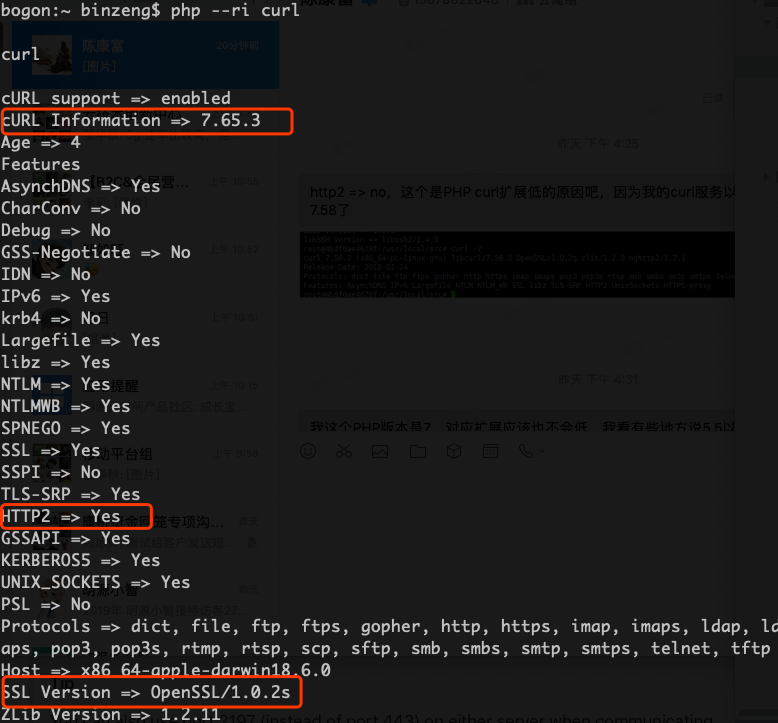
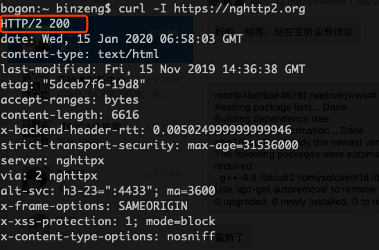

# ios-token推送说明

---

## 1、苹果基于token的推送所使用的通信协议为HTTP/2
> [https://developer.apple.com/documentation/usernotifications/setting_up_a_remote_notification_server/sending_notification_requests_to_apns](https://developer.apple.com/documentation/usernotifications/setting_up_a_remote_notification_server/sending_notification_requests_to_apns)

## 2、验证当前PHP是否支持HTTP2
```shell
$ php --ri curl

curl

cURL support => enabled
cURL Information => 7.65.3
Age => 4
Features
AsynchDNS => Yes
CharConv => No
Debug => No
GSS-Negotiate => No
IDN => No
IPv6 => Yes
krb4 => No
Largefile => Yes
libz => Yes
NTLM => Yes
NTLMWB => Yes
SPNEGO => Yes
SSL => Yes
SSPI => No
TLS-SRP => Yes
HTTP2 => Yes
GSSAPI => Yes
KERBEROS5 => Yes
UNIX_SOCKETS => Yes
PSL => No
Protocols => dict, file, ftp, ftps, gopher, http, https, imap, imaps, ldap, ldaps, pop3, pop3s, rtmp, rtsp, scp, sftp, smb, smbs, smtp, smtps, telnet, tftp
Host => x86_64-apple-darwin18.6.0
SSL Version => OpenSSL/1.0.2s
ZLib Version => 1.2.11
libSSH Version => libssh2/1.9.0
```



## 3、不支持时如何处理
通过上图，确认是否满足以下条件

- cURL Information >= 7.54.0
- SSL Version >= OpenSSL/1.0.2s

如果不满足，则需升级`curl`和/或`openssl`

## 4、升级后如何验证是否满足上步要求
```shell
$ curl -I 

HTTP/2 200
date: Wed, 15 Jan 2020 07:12:45 GMT
content-type: text/html
last-modified: Fri, 15 Nov 2019 14:36:38 GMT
etag: "5dceb7f6-19d8"
accept-ranges: bytes
content-length: 6616
x-backend-header-rtt: 0.003159
strict-transport-security: max-age=31536000
server: nghttpx
via: 2 nghttpx
alt-svc: h3-23=":4433"; ma=3600
x-frame-options: SAMEORIGIN
x-xss-protection: 1; mode=block
x-content-type-options: nosniff
```


如果返回头中标识的协议为`HTTP/2`，则表示达到要求，此时也可通过`php --ri curl`验证是否支持`HTTP/2`。


---

#### 可用的apt-get源
```
deb http://mirrors.163.com/debian/ stretch main non-free contrib
deb http://mirrors.163.com/debian/ stretch-updates main non-free contrib
deb http://mirrors.163.com/debian/ stretch-backports main non-free contrib
deb-src http://mirrors.163.com/debian/ stretch main non-free contrib
deb-src http://mirrors.163.com/debian/ stretch-updates main non-free contrib
deb-src http://mirrors.163.com/debian/ stretch-backports main non-free contrib
deb http://mirrors.163.com/debian-security/ stretch/updates main non-free contrib
deb-src http://mirrors.163.com/debian-security/ stretch/updates main non-free contrib
```